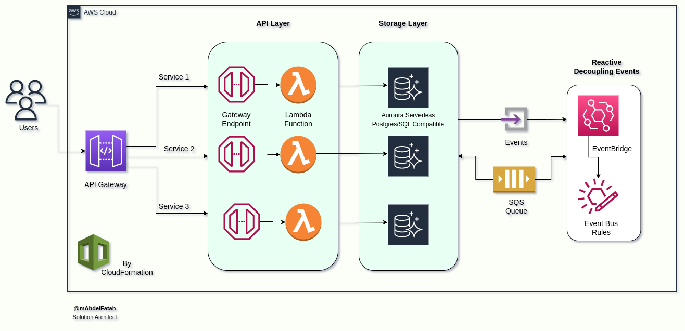
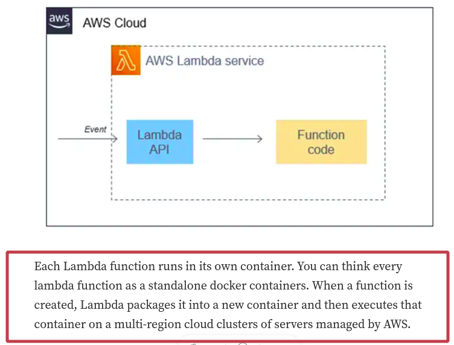
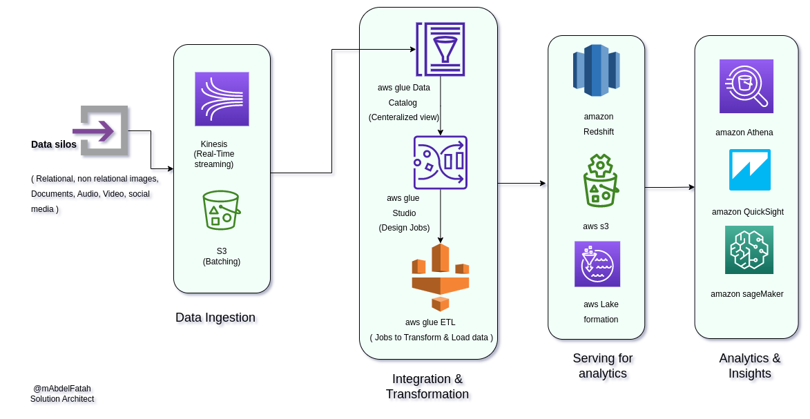

# AWS Solutions Architecture

## Solution One: Monolothic to Microservices solution

The above solution architecture for breaking down a monolithic application into microservices utilizes several key AWS services, including the API Gateway, Lambda functions, Amazon Aurora, and AWS EventBridge. 

- The API Gateway acts as the entry point for incoming requests, routing them to the appropriate Lambda function for processing.
- The Lambda functions, written in the language of your choice, handle the specific logic for each microservice.
- Amazon Aurora provides a fully managed relational database for storing data,
- AWS EventBridge enables communication between the different microservices through the use of events. 

This architecture allows for greater scalability and flexibility in the development and deployment of our application.

#### Why Lambda

To be honest, __there is no ideal solution__, it always depends, there are also use cases where containerization with AWS ECS or Fargate may be a better fit, such as when you need to run a specific version of a language or runtime, or when you need more fine-grained control over the resources allocated to your containers.

Lambda functions are a serverless compute service provided by AWS, which allows you to run code without provisioning or managing servers. This can provide several benefits when compared to using containerization with AWS ECS or Fargate. Some of the reasons why you may have chosen to use Lambda instead of Docker and AWS ECS or Fargate in the solution architecture include, Cost-efficiency, Scalability, Flexibility, and Simplicity.

## Solution Two: Data Analysis process - from OnPrem to cloud

The above solution for migrating on-premises data analysis processes to the AWS cloud utilizes several key AWS services to handle data ingestion, integration and transformation, analytics serving, and analytics insights.

- The first step in the process is data ingestion, which is handled by using Kinesis for streaming data into the cloud. 
- Next, we use Glue ETL, Glue Data Catalog, and Glue Studio for integration and transformation of the data. 
- After that, we use AWS Lake Formation to set up a data lake for analytics serving.
- Finally, we use AWS Athena for querying the data, and AWS QuickSight and SageMaker for analytics insights. 

This architecture allows for the ability to handle large amounts of data, perform complex transformations, and gain insights in real-time. It also provides the ability to leverage the scalability and cost-effectiveness of the cloud for data analysis processes that were previously limited by on-premises infrastructure.

